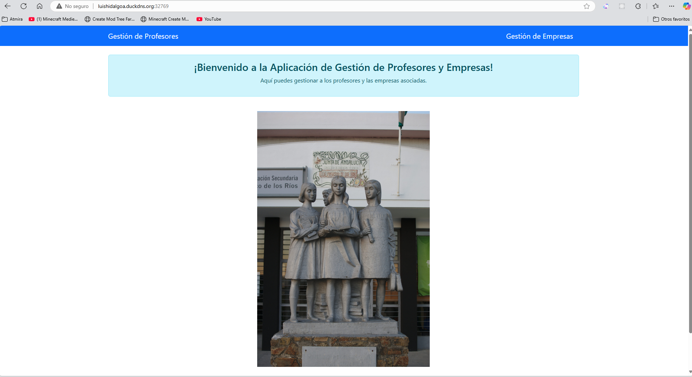
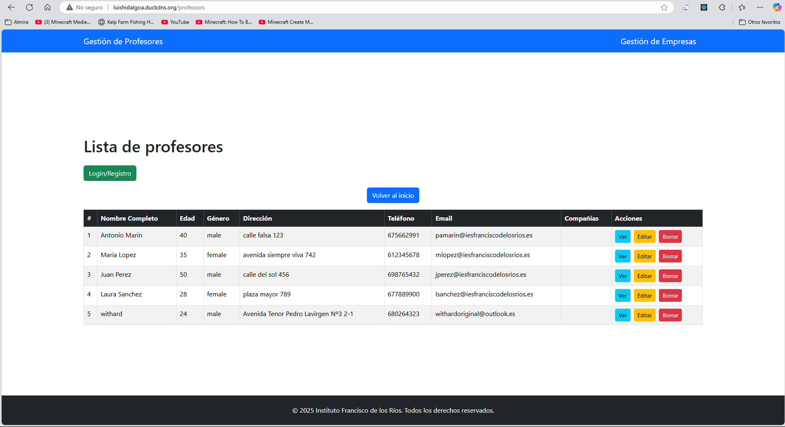

# Documentación: Despliegue de Laravel con Docker

## 1. Prerrequisitos
Antes de comenzar, nos aseguramos de tener instalado:

- [Docker](https://www.docker.com/get-started)
- [Docker Compose (opcional)](https://docs.docker.com/compose/install/)
- Git (para clonar el repositorio si es necesario)

## 2. Ubicación del `Dockerfile`
El `Dockerfile` se encuentra en la ruta **raíz** del proyecto Laravel. por lo

## 3. Contenido del `Dockerfile`
El `Dockerfile` se encargara de construir una imagen paso por paso en base a lo que le programemos, Por decirlo de otra forma es como automatizar el interactuar con un sistema operativo

```dockerfile
# Usamos la imagen oficial de PHP con Apache
FROM php:8.3.0-apache-bullseye

# Instalamos dependencias necesarias
RUN apt-get update && apt-get install -y \
    git \
    curl \
    libpng-dev \
    libonig-dev \
    libxml2-dev \
    libzip-dev \
    zip \
    unzip \
    && apt-get clean && rm -rf /var/lib/apt/lists/*

# Instalamos extensiones PHP necesarias para Laravel
RUN docker-php-ext-install pdo_mysql zip mbstring exif pcntl bcmath gd

# Copiamos Composer desde una imagen oficial
COPY --from=composer:latest /usr/bin/composer /usr/bin/composer

# Configuración de PHP (modo desarrollo)
RUN cp $PHP_INI_DIR/php.ini-development $PHP_INI_DIR/conf.d/php.ini

# Configuramos Apache para servir Laravel desde la carpeta "public"
RUN sed -i 's#DocumentRoot /var/www/html#DocumentRoot /var/www/html/public#g' /etc/apache2/sites-available/000-default.conf
RUN a2enmod rewrite

# Definimos la carpeta de trabajo
WORKDIR /var/www/html

# Copiamos el código fuente del proyecto al contenedor
COPY . .

# Instalamos las dependencias de Laravel
RUN composer install --no-dev --optimize-autoloader

# Ajustamos permisos para que Apache pueda acceder a los archivos
RUN chown -R www-data:www-data /var/www/html

# Exponemos el puerto 80 para servir la aplicación
EXPOSE 80

# Iniciamos Apache al ejecutar el contenedor
CMD ["apache2-foreground"]
```

### Explicación del `Dockerfile`

1. **Imagen Base**
   - `FROM php:8.3.0-apache-bullseye` Utiliza PHP 8.3 con Apache como servidor web.

4. **Composer**
   - Se copia Composer desde una imagen optimizada para no tener que instalarlo manualmente.

5. **Configuración de PHP**
   - Se habilita el archivo `php.ini-development`.

6. **Configuración de Apache**
   - Se modifica el `DocumentRoot` para que apunte a la carpeta `public` de Laravel.
   - Se habilita el módulo `mod_rewrite` para que las rutas de Laravel funcionen correctamente.

7. **Definición del Directorio de Trabajo**
   - `WORKDIR /var/www/html` → Define la raíz del proyecto dentro del contenedor.

8. **Copia del Código y Dependencias**
   - `COPY . .` Copia el código fuente dentro del contenedor.
   - `RUN composer install --no-dev --optimize-autoloader` Instala las dependencias sin las de desarrollo, optimizando el autoloader.

9. **Permisos**
   - `chown -R www-data:www-data /var/www/html` da permisos a Apache para acceder a los archivos.

10. **Exposición del Puerto y Inicio de Apache**
    - `EXPOSE 80` Expone el puerto 80 del contenedor.
    - `CMD ["apache2-foreground"]` Inicia Apache cuando el contenedor arranca.

## 4. Uso de `docker-compose.yml`

Se ha configurado un archivo `docker-compose.yml` que permite ejecutar Laravel de manera sencilla. El contenido del archivo es el siguiente:

```yaml
services:
  app:
    build:
      context: ./
    ports:
      - "${HTTPD_PORT}:80"
    working_dir: /var/www/html
    networks:
      - laravel_network

networks:
  laravel_network:
    driver: bridge
```

### 4.1. Levantar los contenedores con `docker-compose`
Para arrancar el compose debemos escribir el siguiente comando en la terminal. (usamos -d para arrancarlo en 2º plano)
```bash
docker-compose up -d
```

ahora podras acceder a tu aplicación Laravel en `http://localhost:8000`. En mi caso lo he desplegado en AWS por lo que accedere a traves de 
[http://luishidalgoa.duckdns.org:32769](http://luishidalgoa.duckdns.org:32769)


## 5. Repositorio del Proyecto
Este despliegue ha sido realizado sobre el siguiente repositorio:
[Laravel_Proyecto_FPDual](https://github.com/luishidalgoa/Laravel_Proyecto_FPDual)


# Despliegue frontend con Docker

Para esta nueva seccion mostrare el docker build del front en react y del docker compose actualizado con backend y frontend. Por ultimo lo desplegare en AWS.

## 1. Dockerfile Frontend
En el siguiente fragmento de codigo se puede ver que creamos un contenedor con node y apache, en el cual instalamos las dependencias necesarias para el front y copiamos el build del front en la carpeta de apache.
```dockerfile
FROM node:18 AS build-stage
WORKDIR /react-app
COPY . .
RUN npm install
RUN npm run build

# Fase de producción con Apache
FROM httpd:2.4
WORKDIR /usr/local/apache2/htdocs/
COPY --from=build-stage /react-app/dist/ .
```

## 2. Docker-compose.yml
Cabe destacar como nota que el fichero dockerfile lo tengo subido en el github del proyecto laravel, por eso hacemos un ../carpeta_del_proyecto_react . Para acceder al dockerbuild del proyecto react. Dando por hecho que tanto el proyecto ract como el de laravel se hubican en el mismo arbol de directorios.

Lo que estamos haciendo es construir la imagen de ambos contenedores y les abrimos los puertos ha ambos y los conectamos a la misma red para que el front se pueda comunicar con el back
````yaml
services:
  laravel:
    build:
      context: ./
    ports:
      - "8000:80"
    working_dir: /var/www/html
    networks:
      - laravel_network

  react:
    build:
      context: ../React-App_DWEC--LARAVEL/
    ports:
      - "80:80"
    networks:
      - laravel_network

networks:
  laravel_network:
    driver: bridge
````

## 3. Despliegue en AWS
como se puede observar estamos conectados al puerto 80 de la maquina el cual nos carga la aplicacion de react.
